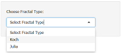
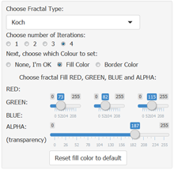
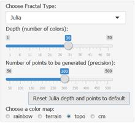
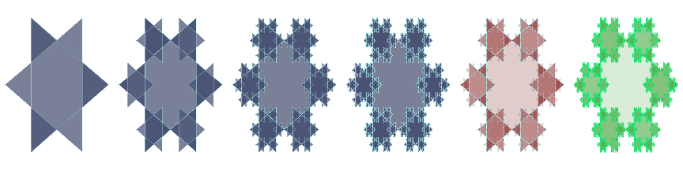
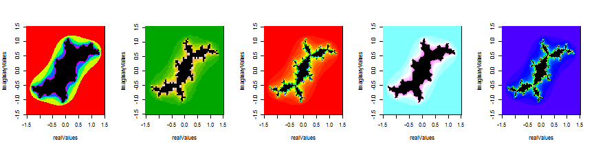

## Fractal Simulator application
Welcome to my <span class="red2">Coursera - Developing Data Products</span> course Assignment!  
### <b><center>An introduction </center></b>
I've always been fond of <span class="red2">Fractals</span>, as they put a mathematical order in chaos. And since this assignment was centered on my <span class="red2">Shiny and Slidify</span> capabilities, not on a specific algorythm in the backend, I decided to create a <span class="red2">Fractal Player</span>. Shiny application is deployed at this <a href="http://andreataglioni.shinyapps.io/Fractal_Simulator">link</a>, source files in GitHub <a href="http://github.com/andreataglioni/FractalSimulator">here</a> (subfolder AppSourceCode).

### <b><center>Credits </center></b>
Not to reinvent the wheel, like a Data Scientist, I started from two base fractal algorythms I came into contact on the web in the past, for which I have to thank:  
1. <span class="red2">Allan Roberts</span>, for his base Koch Snowflake fractal script (Oct. 2013)  
2. <span class="red2">Mike Hewner</span>, for his Julia Set fractal script (Oct. 2012)  

I put all my <span class="red2">programming effort</span> to <span class="red2">evolve this code to accept parameters</span> in input in order to <span class="red2">change shape and colors</span>...  

--- .class #id  &twocolwithwidth .codefont 
## How it works: the sidebar panel  
*** =left1 width:70%
<p>
The Application starts with a sidebar whith a <span class="red2">selection Box</span>:  
  
*** =right1 width:30%
<center>

 
</center>
*** =left width:25%
<p>
  


*** =right width:75%
Based on user selection, <span class="red2">sidebar changes</span>, presenting more options:  

For the <span class="red2">Koch</span> fractal user can choose: 
- number of <span class="red2">iterations</span> (changing the shape of the snowflake)  
- <span class="red2">Fill or Border color</span>, specifying Red, Green, Blue and Alpha (transparency) components.  

For the <span class="red2">Julia</span> fractal user can choose:   

- <span class="red2">depth</span> (changing the number of colors in the fractal)  
- <span class="red2">points</span> (changing the number of points in the fractal, i.e. the precision) 
- Fractal <span class="red2">Color schema</span>, choosing from four different color palettes.  

In both layouts are present buttons which enable <span class="red2">sliders reset</span>.  
After parameter change, <span class="red2">fractal is generated</span> in right panel.  


--- .class #id .codefont
## How it works: Koch Fractal Generation

Changes in the sidebar panel <span class="red2">trigger the launch</span> of fractal generation functions.
For the Koch snowflake, the <span class="red2">function is launched as follows</span> (here with sample parameters):


```r
par(mfrow=c(1,6));
KochSnowflakeExample("#495273BB", "#BBFFFF50", numiter=1) # Fill RGB(73, 82, 115, Alpha=187) - Border RGB(187,255,255,Alpha=80) - Numiter=1
KochSnowflakeExample("#495273BB", "#BBFFFF50", numiter=2) # Fill RGB(73, 82, 115  Alpha=187) - Border RGB(187,255,255,Alpha=80) - Numiter=2
KochSnowflakeExample("#495273BB", "#BBFFFF50", numiter=3) # Fill RGB(73, 82, 115 ,Alpha=187) - Border RGB(187,255,255,Alpha=80) - Numiter=3
KochSnowflakeExample("#495273BB", "#BBFFFF50", numiter=4) # Fill RGB(73, 82, 115, Alpha=187) - Border RGB(187,255,255,Alpha=80) - Numiter=4
KochSnowflakeExample("#92383941", "#BBFFFF50", numiter=3) # Fill RGB(146,56,57, Alpha=65)  - Border RGB(187,255,255,Alpha=80) - Numiter=3
KochSnowflakeExample("#4CA84334", "#29E87DAC", numiter=4) # Fill RGB(76, 168, 67, Alpha=52)  - Border RGB(41,232,125,Alpha=172) - Numiter=4
```

 
<br clear=left>The first four fractals differentiate only on the <span class="red2">number of iterarions</span>, from 1 to 4. In the fifth fractal we changed <span class="red2">Fill colors RGB and Alpha</span>, with 3 iterations. In the sixth we changed both <span class="red2">Fill and Border colors</span> to get a  fully colored Koch snowflake.  

--- .class #id .codefont
## How it works: Julia Set Fractal Generation
For <span class="red2">Julia set</span> I preferred working more on the <span class="red2">core algorythm</span> than on colors. So I played on <span class="red2">points</span> (number of points on X axis - real - and Y axis - complex) and on <span class="red2">depth</span> (number of colors in the plot)
The function is launched as follows (here with sample parameters):


```r
par(mfrow=c(1,5));
generateJuliaFancy(300, 6, rainbow) # Points=300, Depth=6, Palette=rainbow
generateJuliaFancy(60, 13, terrain.colors) # Points=60, Depth=13, Palette=terrain
generateJuliaFancy(160, 50, rainbow) # Points=160, Depth=50, Palette=rainbow
generateJuliaFancy(200, 8, cm.colors) # Points=200, Depth=30, Palette=cm
generateJuliaFancy(300, 30, topo.colors) # Points=300, Depth=30, Palette=topo
```

 
<br clear=left>At each update, at the right-bottom of the page, some data are <span class="red2">reactively calculated</span> and displayed (HEX colors, Iterations, Palette, Points, credits).

